---
## Front matter
title: "Отчёт по лабораторной работе №1."
subtitle: "дисциплина: операционные системы"
author: "Тимофеева Екатерина Николаевна"

## Generic otions
lang: ru-RU
toc-title: "Содержание"

## Bibliography
bibliography: bib/cite.bib
csl: pandoc/csl/gost-r-7-0-5-2008-numeric.csl

## Pdf output format
toc: true # Table of contents
toc-depth: 2
lof: true # List of figures
lot: true # List of tables
fontsize: 12pt
linestretch: 1.5
papersize: a4
documentclass: scrreprt
## I18n polyglossia
polyglossia-lang:
  name: russian
  options:
	- spelling=modern
	- babelshorthands=true
polyglossia-otherlangs:
  name: english
## I18n babel
babel-lang: russian
babel-otherlangs: english
## Fonts
mainfont: PT Serif
romanfont: PT Serif
sansfont: PT Sans
monofont: PT Mono
mainfontoptions: Ligatures=TeX
romanfontoptions: Ligatures=TeX
sansfontoptions: Ligatures=TeX,Scale=MatchLowercase
monofontoptions: Scale=MatchLowercase,Scale=0.9
## Biblatex
biblatex: true
biblio-style: "gost-numeric"
biblatexoptions:
  - parentracker=true
  - backend=biber
  - hyperref=auto
  - language=auto
  - autolang=other*
  - citestyle=gost-numeric
## Pandoc-crossref LaTeX customization
figureTitle: "Рис."
tableTitle: "Таблица"
listingTitle: "Листинг"
lofTitle: "Список иллюстраций"
lotTitle: "Список таблиц"
lolTitle: "Листинги"
## Misc options
indent: true
header-includes:
  - \usepackage{indentfirst}
  - \usepackage{float} # keep figures where there are in the text
  - \floatplacement{figure}{H} # keep figures where there are in the text
---

# Цель работы
Целью данной работы является приобретение практических навыков установки операционной системы на виртуальную машину, настройки минимально необходимых для дальнейшей работы сервисов.

# Задание

 1. Создать виртуальную машину
 2. Установить операционную систему
 3. Установить драйвера для VirtualBox
 4. Установить программное обеспечение для создания документации
 5. Выполнить домашнее задание

# Выполнение лабораторной работы

№1. Запускаем виртуальную машину на персональном компьютере и создаём новую
виртуальную машину. Укажем имя виртуальной машины, тип операционной системы –
Linux.(рис. [-@fig:001])

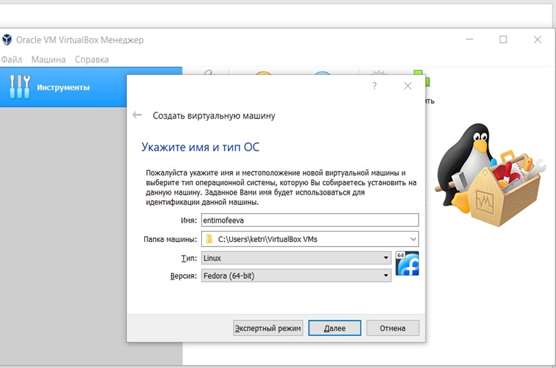{#fig:001 width=70%}

Укажем размер основной памяти виртуальной машины, зададим конфигурацию
жёсткого диска, а также укажем размер диска.(рис. [-@fig:002]), (рис. [-@fig:003]), (рис. [-@fig:004]), (рис. [-@fig:005]), (рис. [-@fig:006]), (рис. [-@fig:007]), (рис. [-@fig:008]), (рис. [-@fig:009])

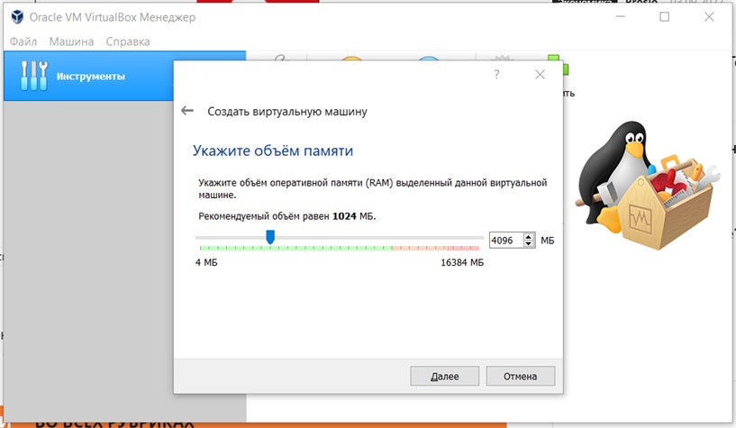{#fig:002 width=70%}

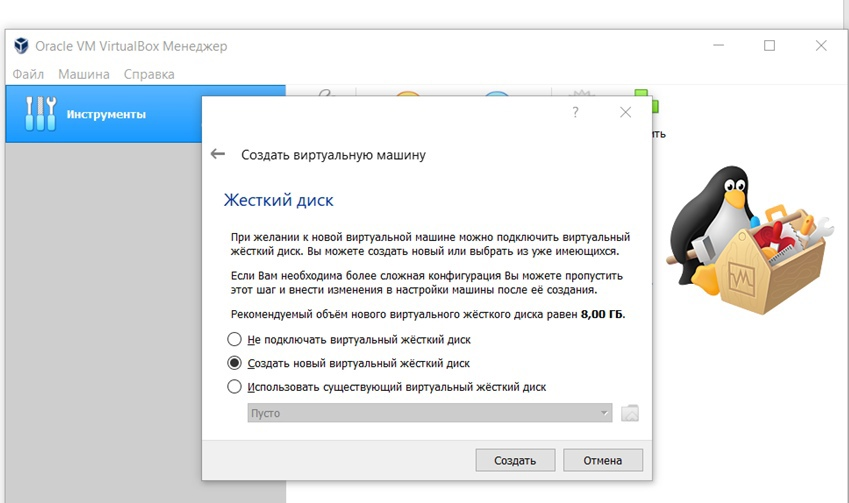{#fig:003 width=70%}

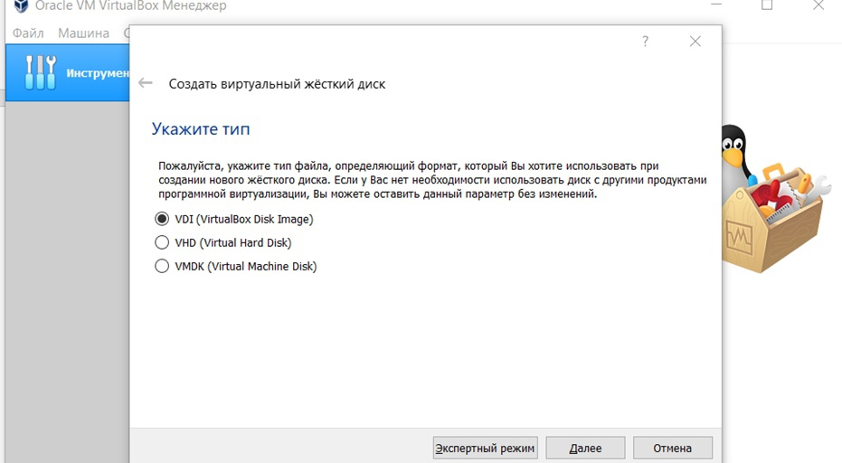{#fig:004 width=70%}

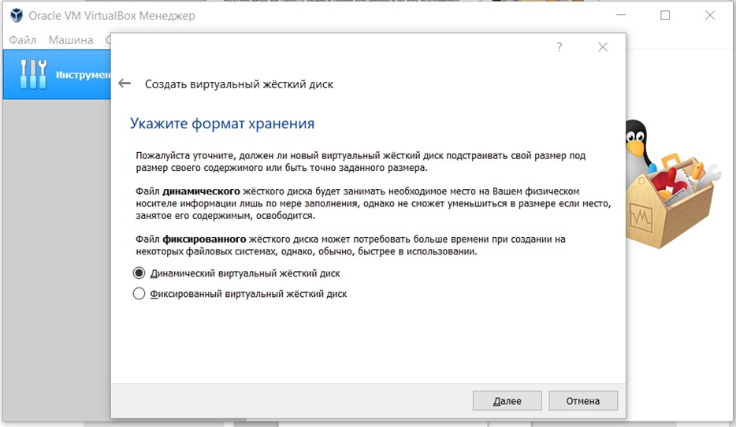{#fig:005 width=70%}

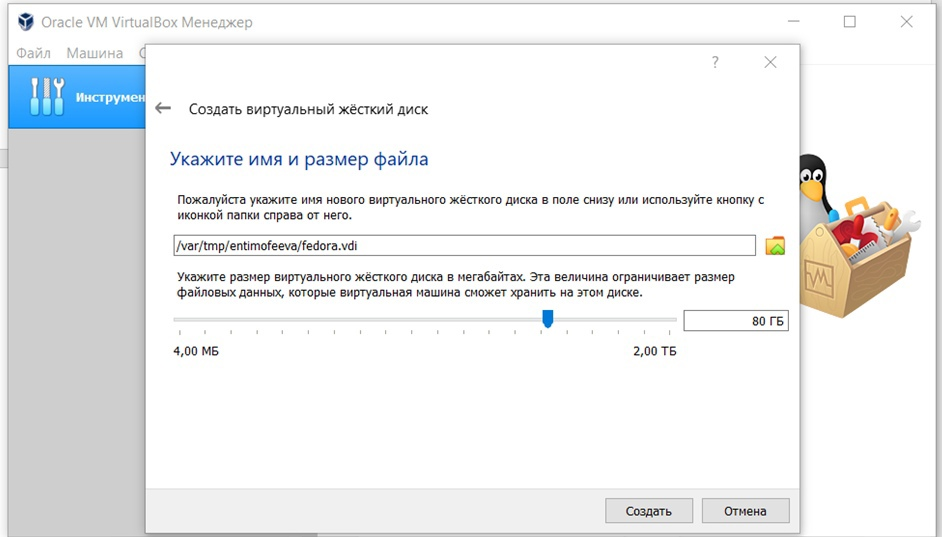{#fig:006 width=70%}

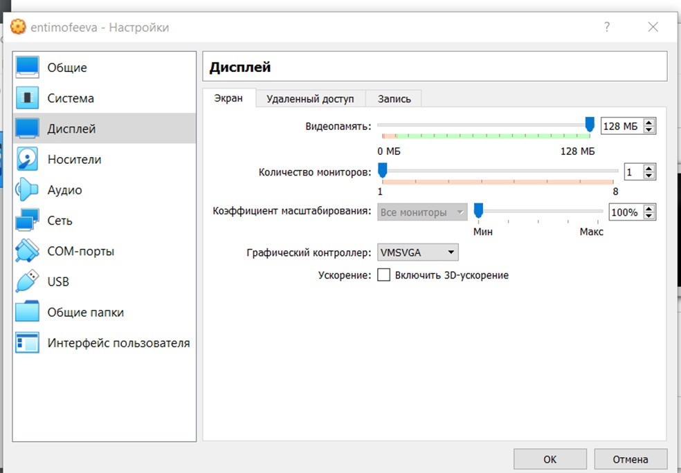{#fig:007 width=70%}

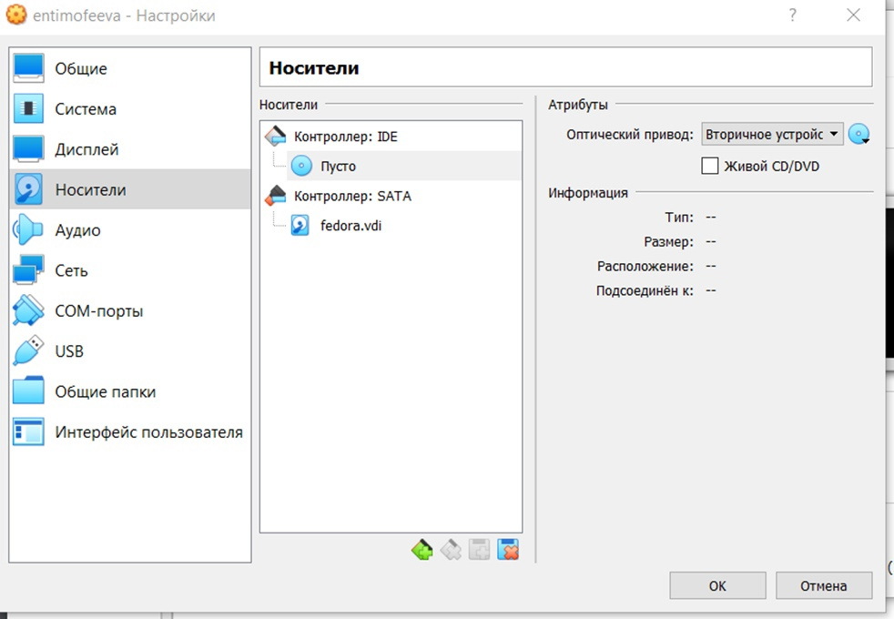{#fig:008 width=70%}

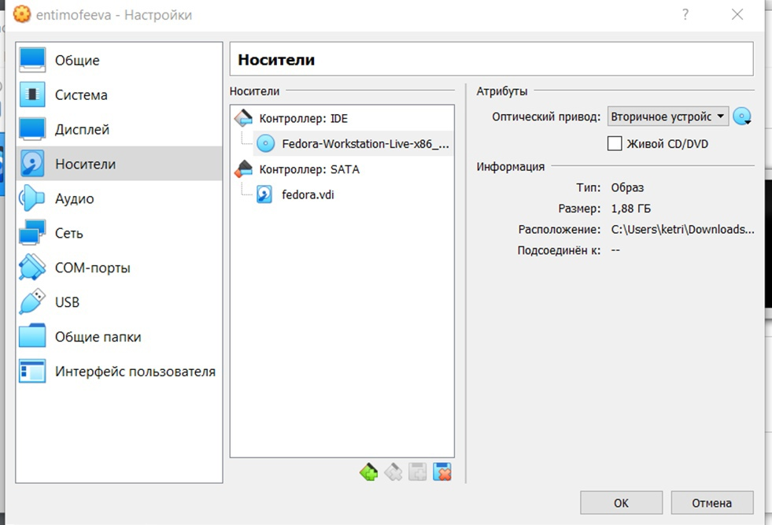{#fig:009 width=70%}

№2. Запускаем виртуальную машину, выбираем язык интерфейса и переходим к
настройкам установки операционной системы. Проверяем часовой пояс, раскладку
клавиатуры. Место установки ОС оставляем без изменения. (рис. [-@fig:0010]) (рис. [-@fig:0011]) (рис. [-@fig:0012]),
(рис. [-@fig:0013]), (рис. [-@fig:0014]), (рис. [-@fig:0015])

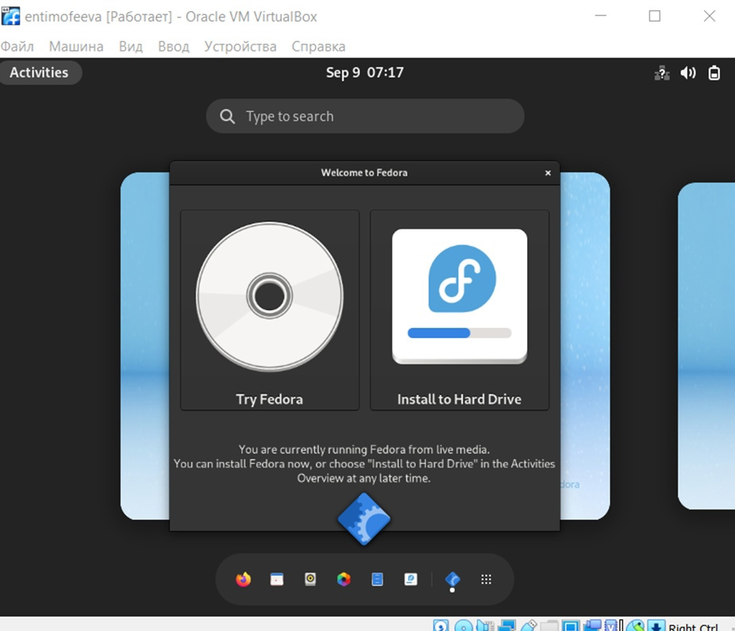{#fig:0010 width=70%}

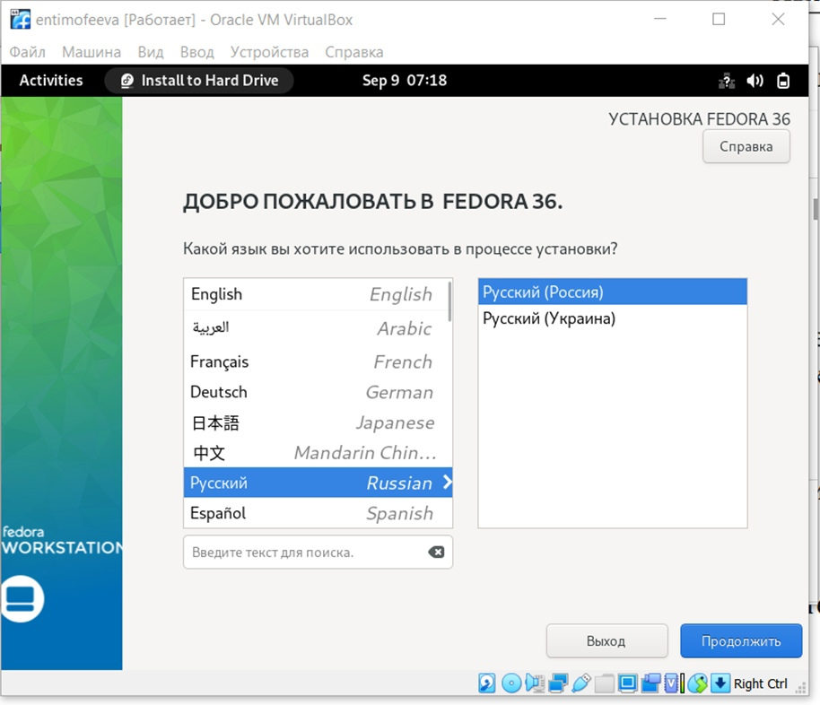{#fig:0011 width=70%}

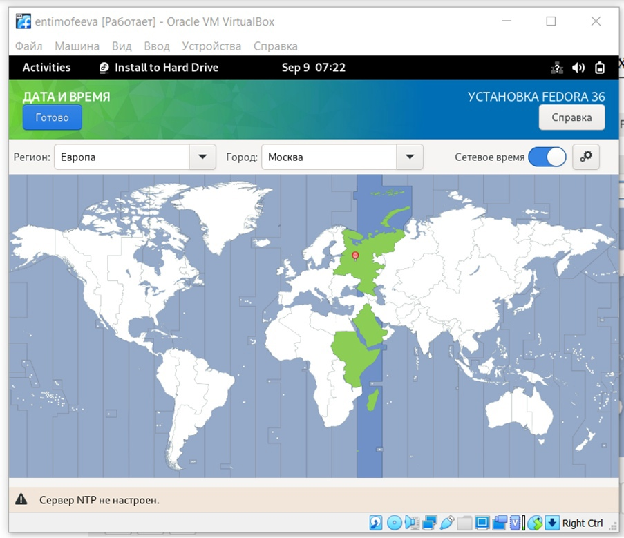{#fig:0012 width=70%}

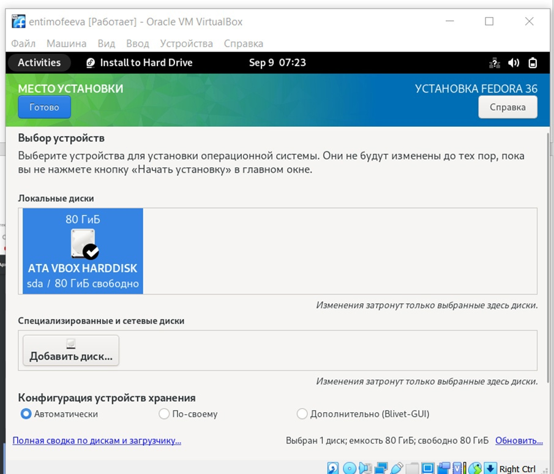{#fig:0013 width=70%}

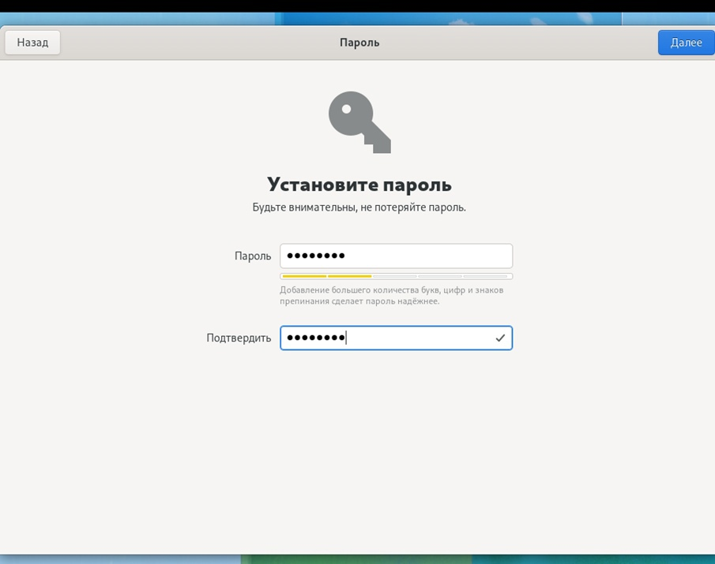{#fig:0014 width=70%}

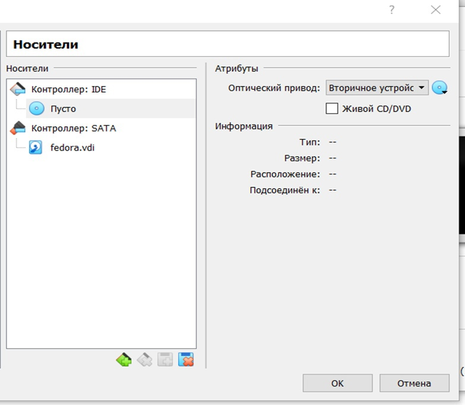{#fig:0015 width=70%}

# Выводы.

Мы приобрели практические навыки установки операционной системы на виртуальную машину, настройки минимально необходимых для дальнейшей работы сервисов.

# Ответы на контрольные вопросы.

1. Какую информацию содержит учётная запись пользователя?
Имя пользователя, зашифрованный пароль пользователя, идентификационный номер пользователя, идентификационный номер группы пользователя, домашний каталог пользователя, командный интерпретатор пользователя.

2. Укажите команды терминала и приведите примеры:

для получения справки по команде: man<название команды>
для перемещения по файловой системе: cd
для просмотра содержимого каталога: ls
для определения объёма каталога: du<имя каталога>
для создания каталогов: mkdir<имя каталога>
для создания файлов: touch<имя файла>
для удаления каталогов: rm<имя каталога>
для удаления файлов: rm-r<имя файла>
для задания определённых прав на файл/каталог: chmod + x <имя файла/каталога>
для просмотра истории команд: history

3. Что такое файловая система? Приведите примеры с краткой характеристикой.

Файловая система - часть операционной системы, назначение которой состоит в том, чтобы обеспечить пользователю удобный интерфейс при работе с данными, хранящимися на диске, и обеспечить совместное использование файлов несколькими пользователями и процессами.
 
Примеры файловых систем:
Ext2, Ext3, Ext4 или Extended Filesystem - стандартная файловая система для Linux.
JFS или Journaled File System была разработана в IBM для AIX UNIX и использовалась в качестве альтернативы для файловых систем ext. Она используется там, где необходима высокая стабильность и минимальное потребление ресурсов.
ReiserFS - была разработана намного позже, но в качестве альтернативы ext3 с улучшенной производительностью и расширенными возможностями.
XFS - высокопроизводительная файловая система. Преимущества: высокая скорость работы с большими файлами, отложенное выделение места, увеличение разделов на лету и незначительный размер служебной информации.

4. Как посмотреть, какие файловые системы подмонтированы в ОС?
С помощью команды mount.

5. Как удалить зависший процесс?
С помощью команды kill.

# Выполнение домашнего задания.

Открываем терминал, в окне терминала проанализируем последовательность загрузки системы, выполнив команду dmesg. Можно просто просмотреть вывод этой команды. (рис. [-@fig:0017]), (рис. [-@fig:0018])

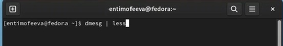{#fig:0017 width=70%}

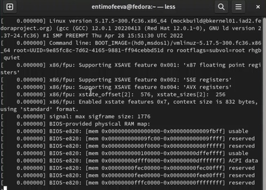{#fig:0018 width=70%}

Получаем следующую информацию с помощью команды grep: (рис. [-@fig:0019]), (рис. [-@fig:0020]), (рис. [-@fig:0021]),
(рис. [-@fig:0022]), (рис. [-@fig:0023])

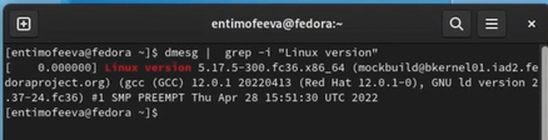{#fig:0019 width=70%}

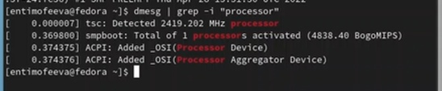{#fig:0020 width=70%}

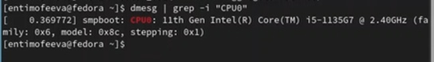{#fig:0021 width=70%}

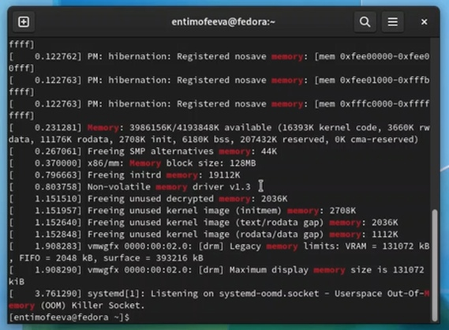{#fig:0022 width=70%}

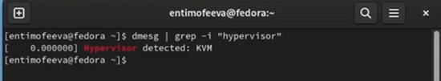{#fig:0023 width=70%}

Заходим в приложение диски, видим, что на корневой том смонтирован тип файловой системы btrfs, ищем в командной строке информацию о btrfs. (рис. [-@fig:0024]), (рис. [-@fig:0025])

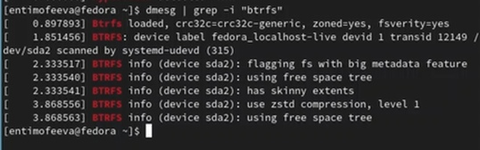{#fig:0024 width=70%}

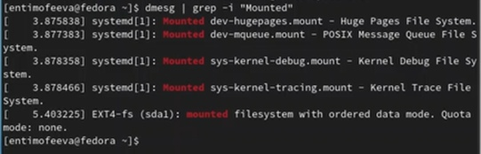{#fig:0025 width=70%}

# Список литературы{.unnumbered}

Колисниченко Д.Н. Самоучитель системного администратора Linux. 

