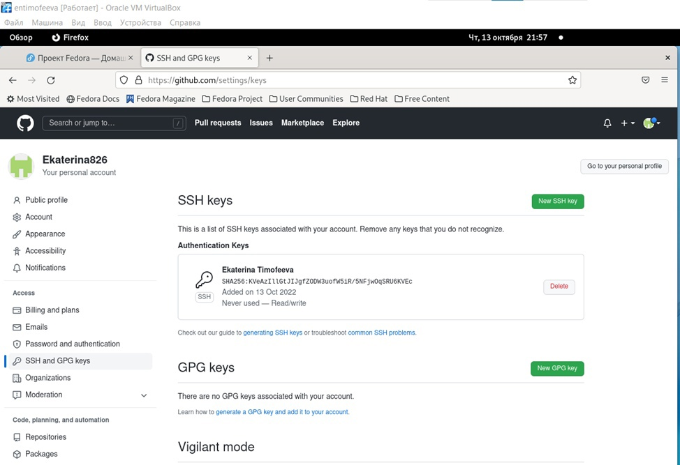
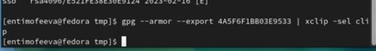
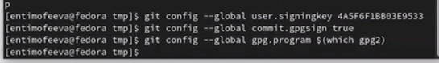
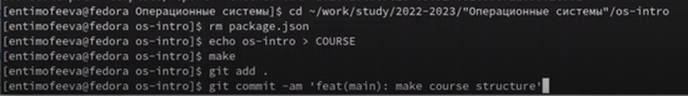

---
## Front matter
title: "Отчёт по лабораторной работе №2."
subtitle: "дисциплина: операционные системы"
author: "Тимофеева Екатерина Николаевна"

## Generic otions
lang: ru-RU
toc-title: "Содержание"

## Bibliography
bibliography: bib/cite.bib
csl: pandoc/csl/gost-r-7-0-5-2008-numeric.csl

## Pdf output format
toc: true # Table of contents
toc-depth: 2
lof: true # List of figures
lot: true # List of tables
fontsize: 12pt
linestretch: 1.5
papersize: a4
documentclass: scrreprt
## I18n polyglossia
polyglossia-lang:
  name: russian
  options:
	- spelling=modern
	- babelshorthands=true
polyglossia-otherlangs:
  name: english
## I18n babel
babel-lang: russian
babel-otherlangs: english
## Fonts
mainfont: PT Serif
romanfont: PT Serif
sansfont: PT Sans
monofont: PT Mono
mainfontoptions: Ligatures=TeX
romanfontoptions: Ligatures=TeX
sansfontoptions: Ligatures=TeX,Scale=MatchLowercase
monofontoptions: Scale=MatchLowercase,Scale=0.9
## Biblatex
biblatex: true
biblio-style: "gost-numeric"
biblatexoptions:
  - parentracker=true
  - backend=biber
  - hyperref=auto
  - language=auto
  - autolang=other*
  - citestyle=gost-numeric
## Pandoc-crossref LaTeX customization
figureTitle: "Рис."
tableTitle: "Таблица"
listingTitle: "Листинг"
lofTitle: "Список иллюстраций"
lotTitle: "Список таблиц"
lolTitle: "Листинги"
## Misc options
indent: true
header-includes:
  - \usepackage{indentfirst}
  - \usepackage{float} # keep figures where there are in the text
  - \floatplacement{figure}{H} # keep figures where there are in the text
---

# Цель работы

Целью работы является изучение идеологии и применение средств контроля версий. Приобретение практических навыков по работе с git.

# Задание

1. Создать базовую конфигурацию для работы с git.

2. Создать ключ SSH.

3. Создать ключ PGP.

4. Настроить подписи git.

5. Зарегистрироваться на Github.

6. Создать локальный каталог для выполнения заданий по предмету.

# Выполнение лабораторной работы

№1. Создаём учётную запись на сайте и заполняем основные данные. (рис. @fig:001).

{#fig:001 width=70%}

Сначала сделаем предварительную конфигурацию git. Откроем терминал и введём следующие команды, указав имя и email владельца репозитория. (рис. @fig:002)

{#fig:002 width=70%}

Для последующей идентификации пользователя на сервере сгенерируем пару ключей (приватный и открытый). (рис. @fig:003).

{#fig:003 width=70%}

Далее необходимо загрузить сгенерённый открытый ключ. Для этого зайдём на сайт под своей учётной записью и перейдём в меню Setting. После этого выберем в боковом меню SSH and GPG keys и нажмём кнопку New SSH key, скопировав из локальной консоли ключ в буфер обмена, вставляем ключ в появившееся на сайте поле и указываем для ключа имя. (рис. @fig:004), (рис. @fig:005)

{#fig:004 width=70%}

{#fig:005 width=70%}

Генерируем pgp-ключ. (рис. @fig:006), (рис. @fig:007), (рис. @fig:008)

{#fig:006 width=70%}

{#fig:007 width=70%}

{#fig:008 width=70%}

Заходим на gh, вставляем скопированный ключ и добавляем его. 

Настроим автоматические подписи коммитов git, используя введёный email, укажем Git при подписи коммитов. (рис. @fig:0010)

{#fig:0010 width=70%}

Настраиваем GitHub, для этого необходимо авторизоваться, вводим нужные команды. Затем в терминале нам приходит код, который нужно вставить в форму, которая открывается при переходе по ссылке. (рис. @fig:0011)

{#fig:0011 width=70%}

Создаём репозиторий курса, с помощью команд, вводимых в терминале. (рис. @fig:0012), (рис. @fig:0013)

{#fig:0012 width=70%}

{#fig:0013 width=70%}

Переходим в каталог курса, удаляем лишние файлы, создаём необходимые каталоги и отправляем файлы на сервер. (рис. @fig:0014)

{#fig:0014 width=70%}

# Выводы

Мы изучили идеологии и применение средств контроля версий. Приобрели практических навыков по работе с git.

# Выолнение контрольных вопросов.

1. Что такое системы контроля версий (VCS) и для решения каких задач они предназначаются? 
Система контроля версий — программное обеспечение для облегчения работы с изменяющейся информацией. Система управления версиями позволяет хранить несколько версий одного и того же документа, при необходимости возвращаться к более ранним версиям, определять, кто и когда сделал то или иное изменение, и многое другое. Системы контроля версий (Version Control System, VCS) применяются для:
• Хранение полной истории изменений 
• причин всех производимых изменений 
• Откат изменений, если что-то пошло не так 
• Поиск причины и ответственного за появления ошибок в программе 
• Совместная работа группы над одним проектом 
• Возможность изменять код, не мешая работе других пользователей 

2. Объясните следующие понятия VCS и их отношения: хранилище, commit, история, рабочая копия. 
Репозиторий - хранилище версий - в нем хранятся все документы вместе с историей их изменения и другой служебной информацией. Commit — отслеживание изменений, сохраняет разницу в изменениях Рабочая копия - копия проекта, связанная с репозиторием (текущее состояние файлов проекта, основанное на версии из хранилища (обычно на последней)) История хранит все изменения в проекте и позволяет при необходимости обратиться к нужным данным. 

3. Что представляют собой и чем отличаются централизованные и децентрализованные VCS? 
Приведите примеры VCS каждого вида. Централизованные VCS (Subversion; CVS; TFS; VAULT; AccuRev): 
• Одно основное хранилище всего проекта 
• Каждый пользователь копирует себе необходимые ему файлы из этого репозитория, изменяет и, затем, добавляет свои изменения обратно Децентрализованные VCS (Git; Mercurial; Bazaar): 
• У каждого пользователя свой вариант (возможно не один) репозитория 
• Присутствует возможность добавлять и забирать изменения из любого репозитория
В классических системах контроля версий используется централизованная модель, предполагающая наличие единого репозитория для хранения файлов. Выполнение большинства функций по управлению версиями осуществляется специальным сервером. В отличие от классических, в распределённых системах контроля версий центральный репозиторий не является обязательным. 

4. Опишите действия с VCS при единоличной работе с хранилищем. 
Сначала создаем и подключаем удаленный репозиторий. Затем по мере изменения проекта отправлять эти изменения на сервер.

5. Опишите порядок работы с общим хранилищем VCS. 
Участник проекта (пользователь) перед началом работы посредством определённых команд получает нужную ему версию файлов. После внесения изменений, пользователь размещает новую версию в хранилище. При этом предыдущие версии не удаляются из центрального хранилища и к ним можно вернуться в любой момент.

6. Каковы основные задачи, решаемые инструментальным средством git? 
Первая — хранить информацию о всех изменениях в вашем коде, начиная с самой первой строчки, а вторая — обеспечение удобства командной работы над кодом. 

7. Назовите и дайте краткую характеристику командам git. 
Наиболее часто используемые команды git: 
• создание основного дерева репозитория: git init 
• получение обновлений
(изменений) текущего дерева из центрального репозитория: git pull 
• отправка всех произведённых изменений локального дерева в центральный репозиторий: git push 
• просмотр списка изменённых файлов в текущей директории: git status 
• просмотр текущих изменения: git diff 
• сохранение текущих изменений: – добавить все изменённые и/или созданные файлы и/или каталоги: git add. – добавить конкретные изменённые и/или созданные файлы и/или каталоги: git add имена_файлов 
• удалить файл и/или каталог из индекса репозитория (при этом файл и/или каталог остаётся в локальной директории): git rm имена_файлов 
• сохранение добавленных изменений: – сохранить все добавленные изменения и все изменённые файлы: git commit -am 'Описание коммита' – сохранить добавленные изменения с внесением комментария через встроенный редактор git commit 
• создание новой ветки, базирующейся на текущей: git checkout -b имя_ветки 
• переключение на некоторую ветку: git checkout
имя_ветки (при переключении на ветку, которой ещё нет в локальном репозитории, она будет создана и связана с удалённой) • отправка изменений конкретной ветки в центральный репозиторий: git push origin имя_ветки • слияние ветки с текущим деревом: git merge —no-ff имя_ветки 
• удаление ветки: – удаление локальной уже слитой с основным деревом ветки: git branch -d имя_ветки – принудительное удаление локальной ветки: git branch -D имя_ветки – удаление ветки с центрального репозитория: git push origin :имя_ветки 

8. Приведите примеры использования при работе с локальным и удалённым репозиториями. git push –all (push origin master/любой branch) 

9. Что такое и зачем могут быть нужны ветви (branches)? 
Ветвление («ветка», branch) — один из параллельных участков истории в одном хранилище, исходящих из одной версии (точки ветвления). 
• Обычно есть главная ветка (master), или ствол (trunk).
• Между ветками, то есть их концами, возможно слияние. Используются для разработки новых функций.

10. Как и зачем можно игнорировать некоторые файлы при commit? 
Во время работы над проектом так или иначе могут создаваться файлы, которые не требуется добавлять в последствии в репозиторий. Например, временные файлы, создаваемые редакторами, или объектные файлы, создаваемые компиляторами. Можно прописать шаблоны игнорируемых при добавлении в репозиторий типов файлов в файл .gitignore с помощью сервисов.

# Список литературы{.unnumbered}

Кулябов Д.С. "Материалы к лабораторной работе"
