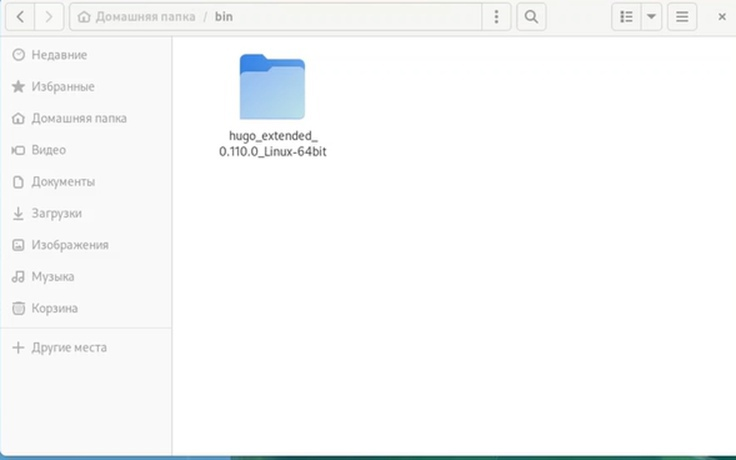
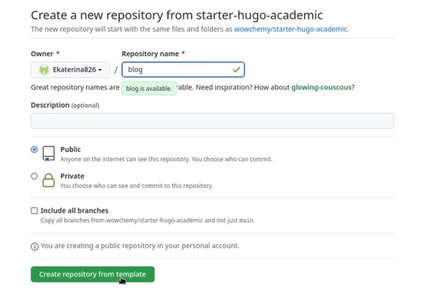
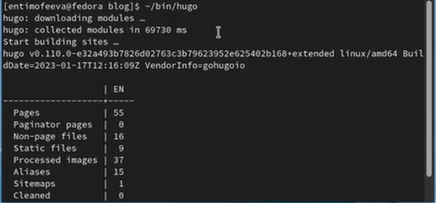
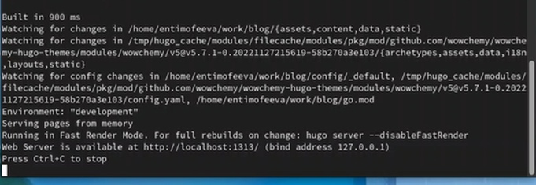
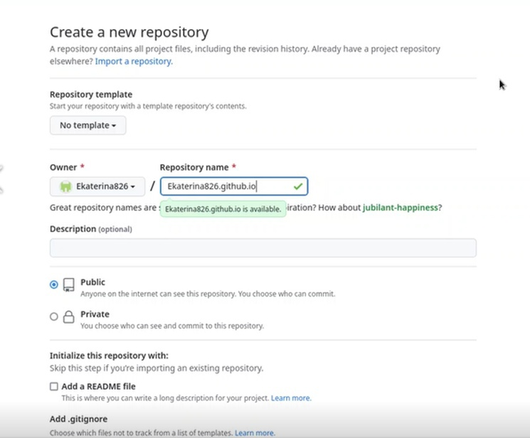
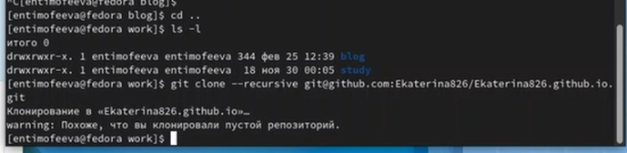
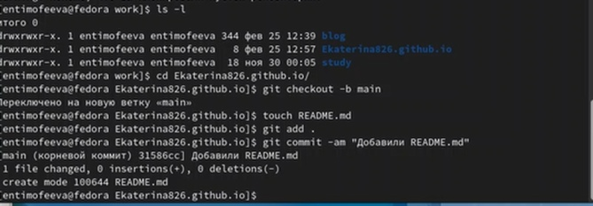
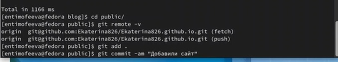

---
## Front matter
title: "Отчёт по первому этапу индивидуального проекта"
subtitle: "Дисциплина: операционные системы"
author: "Тимофеева Екатерина Николаевна"

## Generic otions
lang: ru-RU
toc-title: "Содержание"

## Bibliography
bibliography: bib/cite.bib
csl: pandoc/csl/gost-r-7-0-5-2008-numeric.csl

## Pdf output format
toc: true # Table of contents
toc-depth: 2
lof: true # List of figures
lot: true # List of tables
fontsize: 12pt
linestretch: 1.5
papersize: a4
documentclass: scrreprt
## I18n polyglossia
polyglossia-lang:
  name: russian
  options:
	- spelling=modern
	- babelshorthands=true
polyglossia-otherlangs:
  name: english
## I18n babel
babel-lang: russian
babel-otherlangs: english
## Fonts
mainfont: PT Serif
romanfont: PT Serif
sansfont: PT Sans
monofont: PT Mono
mainfontoptions: Ligatures=TeX
romanfontoptions: Ligatures=TeX
sansfontoptions: Ligatures=TeX,Scale=MatchLowercase
monofontoptions: Scale=MatchLowercase,Scale=0.9
## Biblatex
biblatex: true
biblio-style: "gost-numeric"
biblatexoptions:
  - parentracker=true
  - backend=biber
  - hyperref=auto
  - language=auto
  - autolang=other*
  - citestyle=gost-numeric
## Pandoc-crossref LaTeX customization
figureTitle: "Рис."
tableTitle: "Таблица"
listingTitle: "Листинг"
lofTitle: "Список иллюстраций"
lotTitle: "Список таблиц"
lolTitle: "Листинги"
## Misc options
indent: true
header-includes:
  - \usepackage{indentfirst}
  - \usepackage{float} # keep figures where there are in the text
  - \floatplacement{figure}{H} # keep figures where there are in the text
---

# Цель работы

Приступить к созданию сайта на hugo, создать все необходимые репозитории. 

# Задание

1. Установить необходимое программное обеспечение
2. Создать необходимые репозитории
3. Разместить заготовку сайта на Github

# Выполнение лабораторной работы

Установим необходимое программное обеспечение, скачаем hugo (рис. @fig:001).

{#fig:001 width=70%}

Дальше по ссылке в ТУИС переходим на репозиторий, пишем название и создаём новый репозиторий (рис. @fig:002).

{#fig:002 width=70%}

На Github копируем ссылку нашего репозитория, переходим в терминал и пишем команду клонирования (рис. @fig:003), (рис. @fig:004), (рис. @fig:005)

{#fig:003 width=70%}

{#fig:004 width=70%}

{#fig:005 width=70%}

Выполняем команду, в выводе у нас должна выйти ссылка, мы её копируем и вставляем в браузер (рис. @fig:006)

{#fig:006 width=70%}

Создаём новый репозиторий, куда мы перенесём наш сайт,что позволит видеть его с любого компьютера (рис. @fig:007), (рис. @fig:008)

{#fig:007 width=70%}

{#fig:008 width=70%}

Проверяем наличие нашего репозитория, создаём новую ветку и пустой файл, отправляем его gh, чтобы репозиторий был не пустой (рис. @fig:009)

{#fig:009 width=70%}

Выполняем команду, которая подключит наш репозиторий к папке public внутри нашего блога, комментируем public, чтобы каталоги не игнорировались и повторяем нашу команду (рис. @fig:0010), (рис. @fig:0011)

{#fig:0010 width=70%}

{#fig:0011 width=70%}

Возвращаемся в public, выполняем проверку, видим, что каталог подключён к нашему репозиторию и синхронизируем файлы с репозиторием (рис. @fig:0012)

{#fig:0012 width=70%}

# Выводы

Мы приступили к созданию сайта на hugo и создали все необходимые репозитории. 

# Список литературы{.unnumbered}

1. Что такое сайт (простыми словами)[Электронный ресурс].URL:
https://uguide.ru/chto-takoe-sajt-prostymi-slovami.
